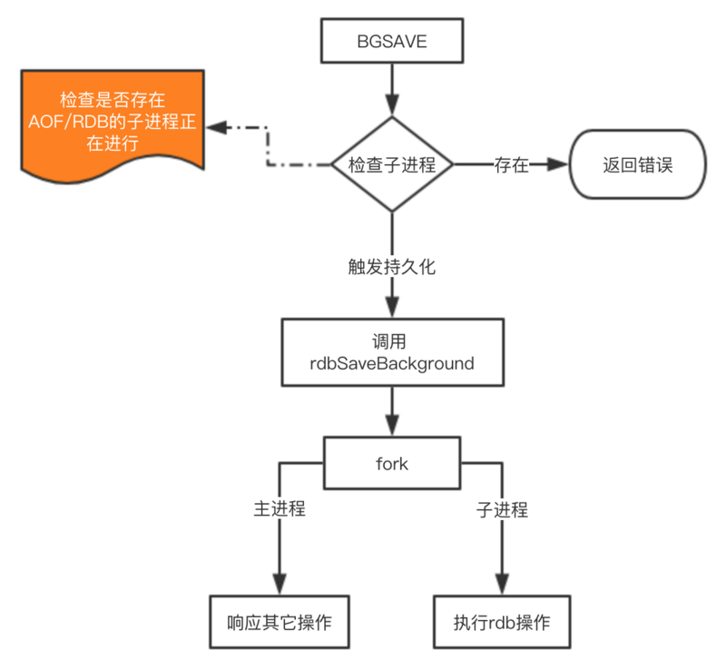
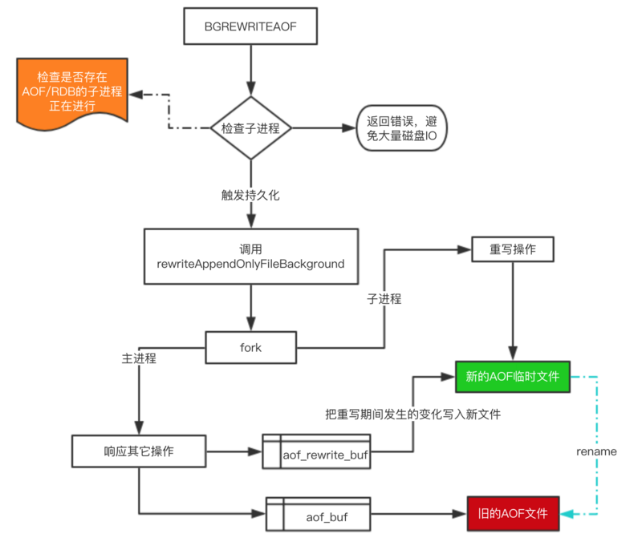
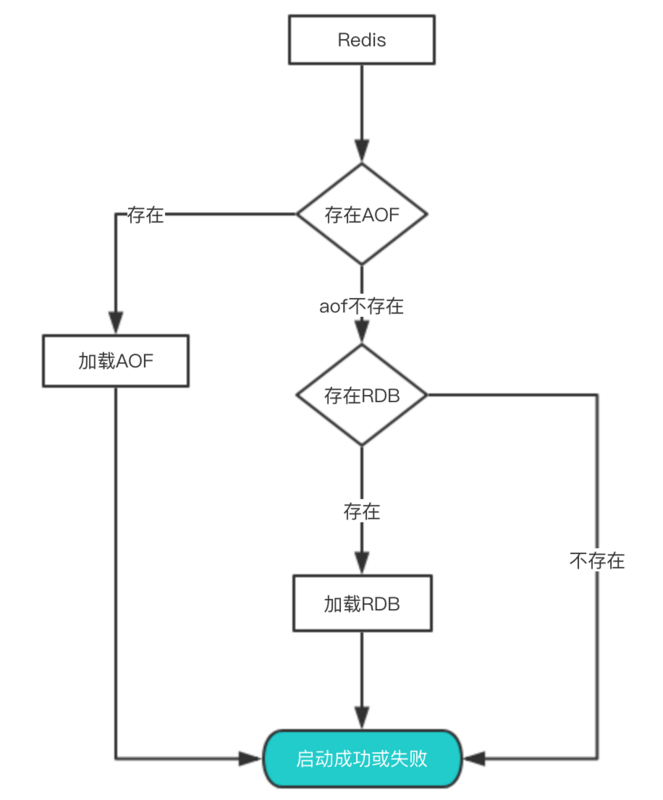

# RDB持久化（快照）
>[!TIP|label:说明]
>RDB持久化是指在客户端输入save、bgsave或者达到配置文件自动保存快照条件时，将Redis 在内存中的数据生成快照保存在名字为 dump.rdb（文件名可修改）的二进制文件中。

## save命令
- save命令会阻塞Redis服务器进程，直到RDB文件创建完毕为止，在Redis服务器阻塞期间，服务器不能处理任何命令请求。 
在客户端输入save

## bgsave命令
- 该触发方式会fork一个子进程，由子进程负责持久化过程，因此阻塞只会发生在fork子进程的时候。
- 服务器进程pid为1349派生出一个pid为1357的子进程，
- 子进程将数据写入到一个临时 RDB 文件中
- 当子进程完成对新 RDB 文件的写入时，Redis 用新 RDB 文件替换原来的 RDB 文件，并删除旧的 RDB 文件。
- bgsave命令执行期间,SAVE命令会被拒绝,不能同时执行两个BGSAVE命令,不能同时执行BGREWRITEAOF和BGSAVE命令

## 原理说明
这里注意的是 fork 操作会阻塞，导致Redis读写性能下降。我们可以控制单个Redis实例的最大内存，来尽可能降低Redis在fork时的事件消耗。以及上面提到的自动触发的频率减少fork次数，或者使用手动触发，根据自己的机制来完成持久化。


## 优点
- RDB是一个非常紧凑（有压缩）的文件,它保存了某个时间点的数据,非常适用于数据备份&灾难恢复.
- RDB在保存RDB文件时父进程唯一需要做的就是fork出一个子进程,接下来的工作全部由子进程来做，父进程不需要再做其他IO操作，所以RDB持久化方式可以最大化redis的性能.
- 与AOF相比,在恢复大的数据集的时候，RDB方式会更快一些.

## 缺点
- Redis意外宕机 时，会丢失部分数据
- 当Redis数据量比较大时，fork的过程是非常耗时的，fork子进程时是会阻塞的，在这期间Redis 是不能响应客户端的请求的。

## 自动触发的场景
- 根据我们的 save m n 配置规则自动触发；
- 从节点全量复制时，主节点发送rdb文件给从节点完成复制操作，主节点会触发 bgsave；
- 执行 debug reload 时；
- 执行 shutdown时，如果没有开启aof，也会触发。

## 配置说明
```bash
# 触发自动保存快照
# save <seconds> <changes>
# save <秒> <修改的次数>
# save 900 1 表示900s内如果有1条是写入命令，就触发产生一次快照，可以理解为就进行一次备份
# save 300 10 表示300s内有10条写入，就产生快照
# 当然如果你想要禁用RDB配置，也是非常容易的，只需要在save的最后一行写上：save ""
save 900 1    
save 300 10   
save 60 10000 

# 设置在保存快照出错时，是否停止redis命令的写入,这个配置也是非常重要的一项配置，这是当备份进程出错时，主进程就停止接受新的写入操作，是为了保护持久化的数据一致性问题
stop-writes-on-bgsave-error yes

# 是否在导出.rdb数据库文件的时候采用LZF压缩,建议没有必要开启，毕竟Redis本身就属于CPU密集型服务器，再开启压缩会带来更多的CPU消耗，相比硬盘成本，CPU更值钱。
rdbcompression yes

#  是否开启CRC64校验
rdbchecksum yes

# 导出数据库的文件名称
dbfilename dump.rdb

# 导出的数据库所在的目录
dir ./
```

# AOF持久化（只追加操作的文件 Append-only file）
>[!TIP|label:说明]
>AOF持久化是通过保存Redis服务器所执行的写命令来记录数据库状态，也就是每当 Redis 执行一个改变数据集的命令时（比如 SET）， 这个命令就会被追加到 AOF 文件的末尾。

## 原理说明
- 在重写期间，由于主进程依然在响应命令，为了保证最终备份的完整性；因此它依然会写入旧的AOF file中，如果重写失败，能够保证数据不丢失。
- 为了把重写期间响应的写入信息也写入到新的文件中，因此也会为子进程保留一个buf，防止新写的file丢失数据。
- 重写是直接把当前内存的数据生成对应命令，并不需要读取老的AOF文件进行分析、命令合并。
- AOF文件直接采用的文本协议，主要是兼容性好、追加方便、可读性高可认为修改修复。



## 优点
- AOF文件是一个只进行追加的日志文件，不需要在写入时读取文件。
- Redis 可以在 AOF 文件体积变得过大时，自动地在后台对 AOF 进行重写 。
- AOF文件可读性高，分析容易

## 缺点
- 对于相同的数据来说，AOF 文件大小通常要大于 RDB 文件
- 根据所使用的 fsync 策略，AOF 的速度可能会慢于 RDB

## 重写
由于AOF 持久化是通过不断地将命令追加到文件的末尾来记录数据库状态的， 所以随着写入命令的不断增加， AOF 文件的体积也会变得越来越大。 且有些命令是改变同一数据，是可以合并成一条命令的。就好比对一个计数器调用了 100 次 INCR，AOF就会存入100 条记录，其实存入一条数据就可以了。(AOF重写机制的触发有两种机制，一个是通过调用命令BGREWRITEAOF,另一种是根据配置文件中的参数触发)

### 重写步骤
- 创建子进程进行AOF重写
- 将客户端的写命令追加到AOF重写缓冲区
- 子进程完成AOF重写工作后，会向父进程发送一个信号
- 父进程接收到信号后，将AOF重写缓冲区的所有内容写入到新AOF文件中
- 对新的AOF文件进行改名，原子的覆盖现有的AOF文件
- 注：AOF重写不需要对现有的AOF文件进行任何读取、分析和写入操作。


## 配置说明
```bash
# 是否开启AOF功能
appendonly no

# AOF文件件名称
appendfilename "appendonly.aof"

# 写入AOF文件的三种方式
# appendfsync always (把每个写命令都立即同步到aof，很慢，但是很安全)
appendfsync everysec # (每秒同步一次，是折中方案,一般情况下都采用 everysec 配置，这样可以兼顾速度与安全，最多损失1s的数据。)
# appendfsync no (edis不处理交给OS来处理，非常快，但是也最不安全)

# 重写AOF时，是否继续写AOF文件
no-appendfsync-on-rewrite no

# 自动重写AOF文件的条件
auto-aof-rewrite-percentage 100 #百分比
auto-aof-rewrite-min-size 64mb #大小

# 是否忽略最后一条可能存在问题的指令,如果该配置启用，在加载时发现aof尾部不正确是，会向客户端写入一个log，但是会继续执行，如果设置为 no ，发现错误就会停止，必须修复后才能重新加载。
aof-load-truncated yes

# 文件重写策略
aof-rewrite-incremental-fsync yes
```

# 性能与实践
通过上面的分析，我们都知道RDB的快照、AOF的重写都需要fork，这是一个重量级操作，会对Redis造成阻塞。因此为了不影响Redis主进程响应，我们需要尽可能降低阻塞。
- 降低fork的频率，比如可以手动来触发RDB生成快照、与AOF重写；
- 控制Redis最大使用内存，防止fork耗时过长；
- 使用更牛逼的硬件；
- 合理配置Linux的内存分配策略，避免因为物理内存不足导致fork失败。
- 如果Redis中的数据并不是特别敏感或者可以通过其它方式重写生成数据，可以关闭持久化，如果丢失数据可以通过其它途径补回；
- 自己制定策略定期检查Redis的情况，然后可以手动触发备份、重写数据；
- 单机如果部署多个实例，要防止多个机器同时运行持久化、重写操作，防止出现内存、CPU、IO资源竞争，让持久化变为串行；
- 可以加入主从机器，利用一台从机器进行备份处理，其它机器正常响应客户端的命令；
- RDB持久化与AOF持久化可以同时存在，配合使用。

# 从持久化中恢复数据
启动时会先检查AOF文件是否存在，如果不存在就尝试加载RDB。那么为什么会优先加载AOF呢？因为AOF保存的数据更完整，通过上面的分析我们知道AOF基本上最多损失1s的数据。
